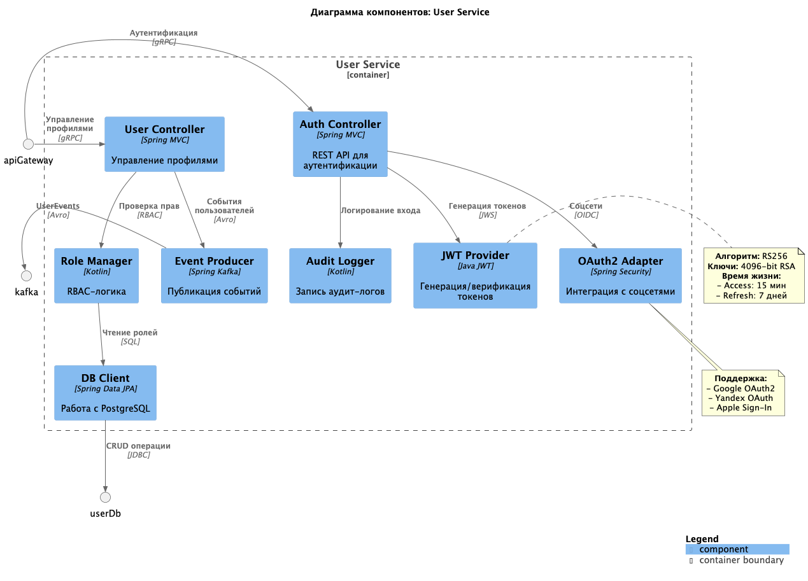
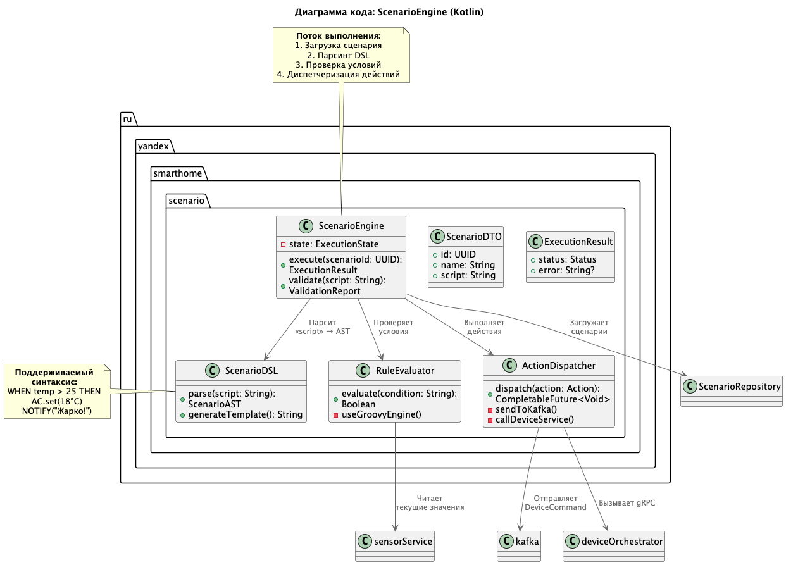

# Project_template

# Задание 1. Анализ и планирование

### 1. Описание функциональности монолитного приложения

Управление отоплением:

    Пользователи могут удалённо включать/выключать отопление в своих домах.
    Система получает данные о температуре с датчиков, установленных в домах.

Мониторинг температуры:

    Пользователи могут просматривать текущую температуру в своих домах через веб-интерфейс.
    Система получает данные о температуре с датчиков, установленных в домах.

### 2. Анализ архитектуры монолитного приложения

    Язык программирования: Java
    База данных: PostgreSQL
    Архитектура: Монолитная, все компоненты системы (обработка запросов, бизнес-логика, работа с данными) находятся в рамках одного приложения.
    Взаимодействие: Синхронное, запросы обрабатываются последовательно.
    Масштабируемость: Ограничена, так как монолит сложно масштабировать по частям.

### 3. Определение доменов и границы контекстов

Домен управления отоплением
    Контекст снятия показаний
    Контекст установки значений
Домен управления температурой
    Контекст снятия показаний
    Контекст установки значений

### **4. Проблемы монолитного решения**

1. Проблема масштабирования. Приходится масштабировать весь сервер, даже если нагрузка только на модуль уведомлений.
2. Единая точка отказа. Падение модуля сценариев "тянет" за собой весь сервис.
3. Долгий цикл разработки. Обновление версии Java для одного модуля требует тестирования всего монолита.
4. Раздутая кодовая база. Время сборки увеличивается на 15% с каждым новым модулем.
5. Ограниченная отказоустойчивостью. Например: падение БД пользователей блокирует работу датчиков.
6. Сложность внедрения новых технологий
   Пример: Невозможно протестировать gRPC для одного модуля без риска для REST-интерфейсов.

### 5. Визуализация контекста системы — диаграмма С4

[Диаграмму контекста в модели C4](./context-monolith-scheme.png)

[Диаграмму контекста в модели C4 (схема)](./context-monolith-scheme.puml)

# Задание 2. Проектирование микросервисной архитектуры

**Диаграмма контейнеров (Containers)**

[Диаграмма контейнеров (Containers)](./container-diagram.png)

[Диаграмма контейнеров (Containers) (схема)](./container-diagram.puml)

**Диаграммы компонентов (Components)**

Диаграмма компонентов: Device Orchestrator Service

[Диаграмма компонентов (Device Orchestrator Service)](./component-diagram-device_orchestrator_service.puml)

[Схема](./component-diagram-device_orchestrator_service-___Device_Orchestrator_Service.png)

Диаграмма компонентов: Sensor Service

[Диаграмма компонентов (Sensor Service)](./component-diagram-sensor-service.puml)
[Схема](./component-diagram-sensor-service-___Sensor_Service.png)

Диаграмма компонентов: IoT Gateway Service

[Диаграмма компонентов (IoT Gateway Service)](./component-diagram-IoT.puml)
[Схема](./component-diagram-IoT-___IoT_Gateway_Service.png)

Диаграмма компонентов: Scenario Service

Диаграмма компонентов (Scenario Service)](./component-diagram-scenario-service.puml)
[Схема](./component-diagram-scenario-service-___Scenario_Service.png)

Диаграмма компонентов: Notification Service

[Диаграмма компонентов: Notification Service](./[component-diagram-notification-service.puml](component-diagram-notification-service.puml))

[component-diagram-notification-service.puml](component-diagram-notification-service.puml)

Диаграмма компонентов: User Service

[component-diagram-user-service.puml](component-diagram-user-service.puml)

**Диаграмма кода Scenario Service **

[Диаграмма кода Scenario Service](diagram-code-ScenarioEngine.puml)

# Задание 3. Разработка ER-диаграммы

Добавьте сюда ER-диаграмму. Она должна отражать ключевые сущности системы, их атрибуты и тип связей между ними.
[er-diagram.puml](er-diagram.puml)

# ❌ Задание 4. Создание и документирование API
